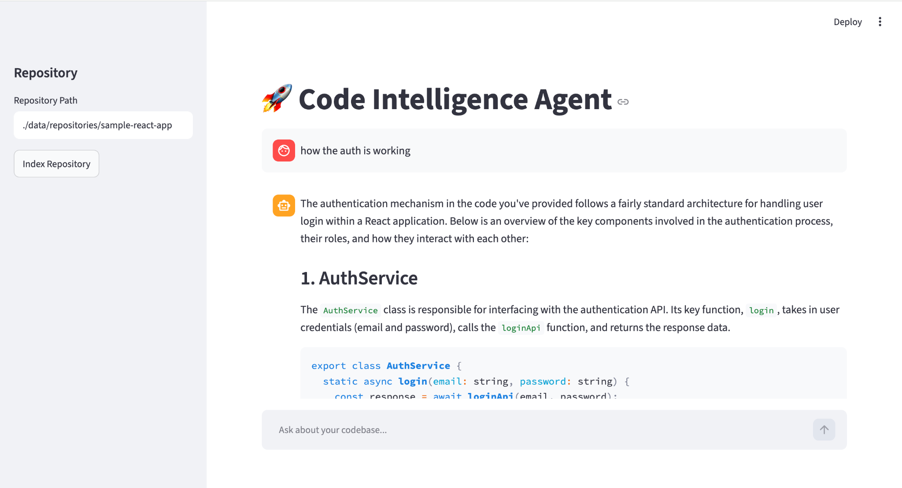
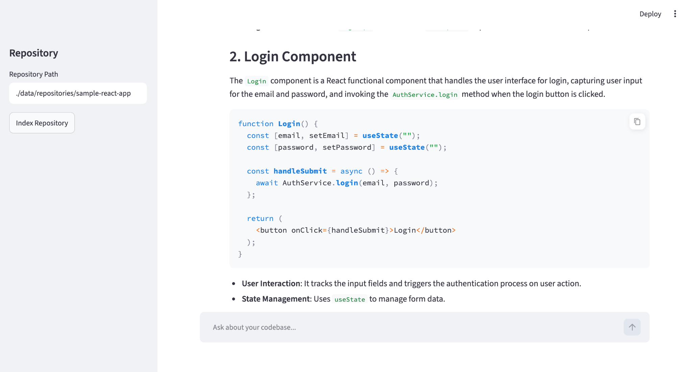

# Code Intelligence Agent




An Agentic RAG platform for understanding large React, JavaScript, TypeScript, and Next.js codebases.

The system ingests source code, extracts metadata, creates embeddings, builds dependency graphs, and allows developers to ask natural language questions about the codebase.

Examples:

- How does user registration work?
- Which files are involved in login?
- What APIs are called by this component?
- Show complete execution flow for checkout.
- What functions call AuthService?
- Which components use useAuth?

---


# 🚀 Quick Start

Follow these steps after cloning the repository.

---

## 1. Clone Repository

```bash
git clone https://github.com/your-org/ai-rag-code-analyser.git

cd ai-rag-code-analyser
```

---

## 2. Create Virtual Environment

### Mac/Linux

```bash
uv venv

source .venv/bin/activate
```

### Windows

```bash
uv venv

.venv\Scripts\activate
```

---

## 3. Install Dependencies

```bash
uv sync
```

---

## 4. Start Infrastructure


#### Start Qdrant

```bash
docker run -d \
--name qdrant \
-p 6333:6333 \
-v $(pwd)/qdrant_storage:/qdrant/storage \
qdrant/qdrant
```

Dashboard:

```text
http://localhost:6333/dashboard
```

---

#### Start Neo4j

```bash
docker run -d \
--name neo4j \
-p 7474:7474 \
-p 7687:7687 \
-e NEO4J_AUTH=neo4j/password \
-v $(pwd)/neo4j_data:/data \
neo4j:latest
```

Dashboard:

```text
http://localhost:7474
```

Credentials:

```text
Username: neo4j
Password: password
```

---

## 5. Configure Environment Variables

Create:

```text
.env
```

```env
OPENAI_API_KEY=YOUR_OPENAI_API_KEY

QDRANT_HOST=localhost
QDRANT_PORT=6333

NEO4J_URI=bolt://localhost:7687
NEO4J_USERNAME=neo4j
NEO4J_PASSWORD=password
```

---

## 6. Add Repository To Analyze

Create directory:

```bash
mkdir -p data/repositories
```

Copy your React project:

```bash
cp -R ~/projects/my-react-app \
data/repositories/
```

Result:

```text
data/
└── repositories/
    └── my-react-app/
```

---

## 7. Index Repository

```bash
uv run python main.py index ./data/repositories/sample-react-app
```

Expected Output:

```text
Loading project...

Loaded 153 files

Generated 1284 chunks

Indexing into Qdrant...

Creating Neo4j graph...

Repository indexed successfully
```

---

## 8. Start Chat Agent

```bash
 uv run streamlit run ui/app.py      
```

Expected:

```text
Code Intelligence Agent

Type 'exit' to quit
```

---

## 9. Ask Questions

Examples:

```text
How does login work?
```

```text
Show execution flow for checkout.
```

```text
Which files call AuthService?
```

```text
Which APIs are used during registration?
```

```text
Generate documentation for authentication.
```

```text
Explain user onboarding architecture.
```

---

# 🔄 Daily Workflow

Start Infrastructure:

```bash
docker compose up -d
```

Activate Environment:

```bash
source venv/bin/activate
```

Index New Repository:

```bash
python main.py index ./data/repositories/project
```

Start Chat:

```bash
python main.py chat
```

---

# 🧹 Cleanup

Delete Qdrant Collection:

```bash
docker exec -it qdrant sh
```

Reset Containers:

```bash
docker compose down -v
```

Remove All Data:

```bash
rm -rf qdrant_storage
rm -rf neo4j_data
```

---

# 🏗 Complete Startup Sequence

A new developer should only need:

```bash
git clone <repo>

cd code-intelligence

python -m venv venv

source venv/bin/activate

pip install -r requirements.txt

docker compose up -d

cp .env.example .env

# Add OpenAI key

python main.py index ./data/repositories/my-react-app

python main.py chat
```

At this point the system is fully operational and ready to answer questions about the indexed codebase.


# Features

## Code Ingestion

Supports:

- JavaScript (.js)
- JSX (.jsx)
- TypeScript (.ts)
- TSX (.tsx)

Automatically ignores:

- node_modules
- .git
- build
- dist
- .next

---

## Metadata Extraction

Extracts:

- Components
- Functions
- Hooks
- Imports
- API Calls

---

## Semantic Search

Uses:

- Sentence Transformers
- Qdrant Vector Database

Allows semantic questions such as:

"How does login work?"

instead of requiring exact keywords.

---

## Dependency Graph

Uses:

- Neo4j

Stores relationships such as:

Login
  -> handleSubmit

handleSubmit
  -> AuthService.login

AuthService.login
  -> /api/login

---

## AI Agent

Uses:

- OpenAI
- LangGraph (future enhancement)

Answers questions using:

- Semantic Retrieval
- Graph Traversal
- Source Code Context

---

# Architecture

React Project
       |
       ▼
Loader
       |
       ▼
Parser
       |
       ▼
Chunker
       |
       ▼
Indexer
       |
       ├── Qdrant
       └── Neo4j
       |
       ▼
Agent
       |
       ▼
LLM
       |
       ▼
Answer

---

# Folder Structure

```text
code-intelligence/

├── ingestion/
│   ├── loader.py
│   ├── parser.py
│   ├── chunker.py
│   └── indexer.py
│
├── storage/
│   ├── qdrant_client.py
│   └── neo4j_client.py
│
├── retrieval/
│   ├── semantic_search.py
│   ├── graph_search.py
│   └── context_builder.py
│
├── agent/
│   ├── tools.py
│   └── code_agent.py
│
├── data/
│   └── repositories/
│
├── main.py
│
├── requirements.txt
│
└── README.md